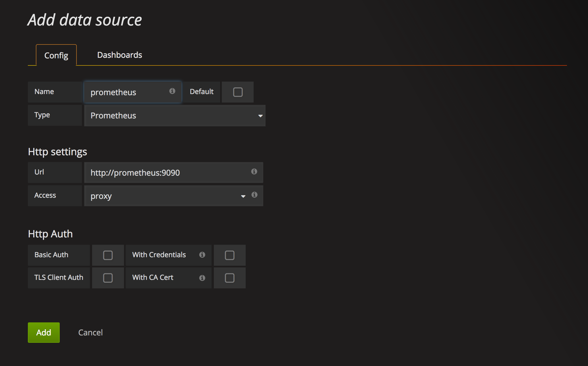
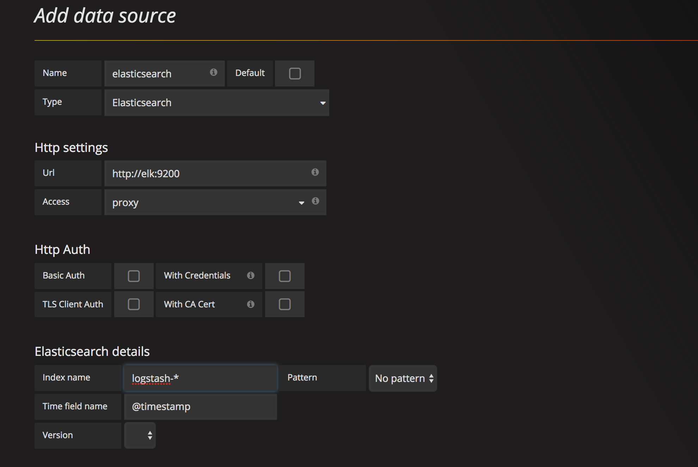
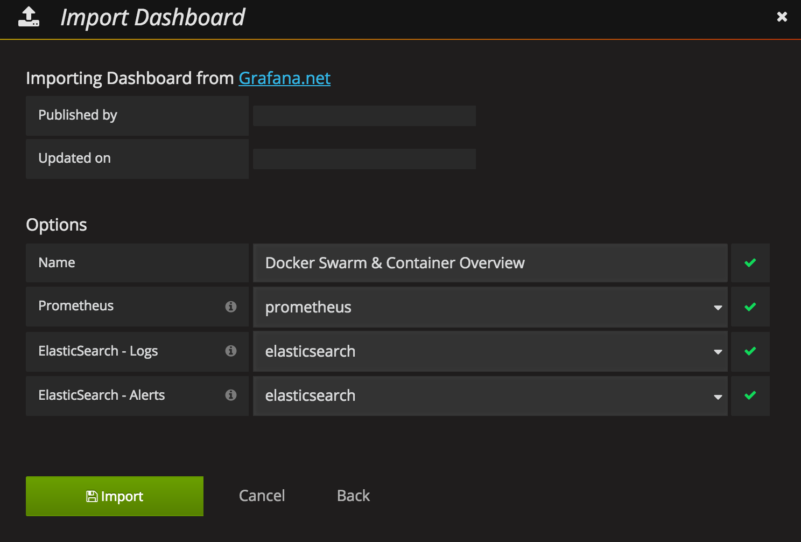
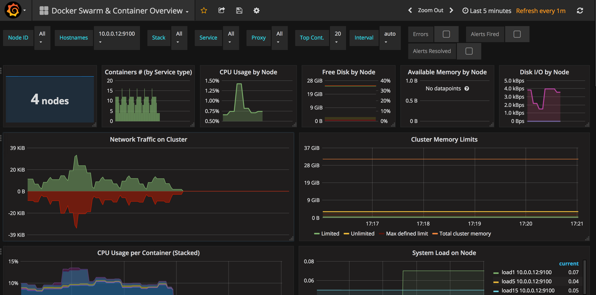

# Prometheus Swarm

A sample image that can be used as a base for collecting Swarm mode metrics in Prometheus

## How to use it

You can configure the full system with the next commands, that create the Prometheus, Grafana and exporters services needed.

```bash
docker network create --driver overlay monitoring
  
docker stack deploy -c docker-stack.yml monitoring
```  

If you get error `failed to find usable hardware address...` on the elasticsearch container, then most likely this can be the fix  

```
sudo sysctl -w vm.max_map_count=262144
```


Once everyting is running you just need to connect to grafana and import the [Docker Swarm & Container Overview](https://grafana.net/dashboards/609)

In case you don't have an Elasticsearch instance with logs and errors you could provide an invalid configuration. But I suggest you to have it correctly configured to get all the dashboard offers.


### Add Data Sources

Navigate to graphana UI using http://<docker-host/docker-swarm-host>:3000 (Default creds: admin/admin)  

- Add prometheus as data source



- Add elasticsearch as data source



- Import [Docker Swarm & Container Overview](https://grafana.net/dashboards/609)



- Dashboard looks like this




### Docker Engine Metrics
In case you have activated the metrics endpoint in your docker swarm cluster you could import the [Docker Engine Metrics](https://grafana.net/dashboards/1229) dashboard as well, which offers complementary data about the docker daemon itself.

More info available about this dashboard and its configuration in this post [Docker Daemon Metrics in Prometheus](https://medium.com/@basilio.vera/docker-swarm-metrics-in-prometheus-e02a6a5745a#.ei8n7eykb)
